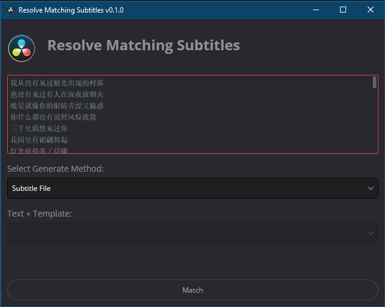

# Davinci Resolve Matching Subtitles



## Motivation

Davinci 18 可以识别字幕，尽管听准确的，但是还是有错误的地方，如果已经有字幕了，那么希望直接使用已有字幕做打轴。目前还没有这个功能。

## 安装

1. 安装 Python >= 3.6
2. 安装 Python 包

```shell
pip install thefuzz
pip install srt
```

或者创建 `davinci` 虚拟环境，再安装上面的包，可能更好一点。

3. 将 `Matching Subtitles.py` 拷贝到 `"%PROGRAMDATA%\Blackmagic Design\DaVinci Resolve\Fusion\Scripts\Utility"`
4. 默认该目录为 `C:\ProgramData\Blackmagic Design\DaVinci Resolve\Fusion\Scripts\Utility`

## 使用

相关视频：<https://www.bilibili.com/video/BV1ft421N7wu>

1. 首先使用 Davinci 创建字幕，最大长度 1
2. 然后 `Workspace` > `Script` > `Matching Subtitles`
3. 修改文本或将字幕输入到文本框中
4. 选择生成方式：
   1. 生成 srt 文件到媒体池
   2. 生成 Text + 视频轨道（需要选择一个 Text+ 作为模板）
5. 点击 Match
6. 对于不同的生成方式：
   1. 如果是字幕文件，项目资源中会创建一个匹配好的字幕，文件名为 `Subtitle` 文件，手动创建一个字幕轨，托入即可
   2. 生成 Text + 视频轨道，会自动创建一个对应的视频轨道

## References

- https://github.com/tmoroney/auto-subs
- https://www.steakunderwater.com/wesuckless/viewtopic.php?t=1411&start=210
