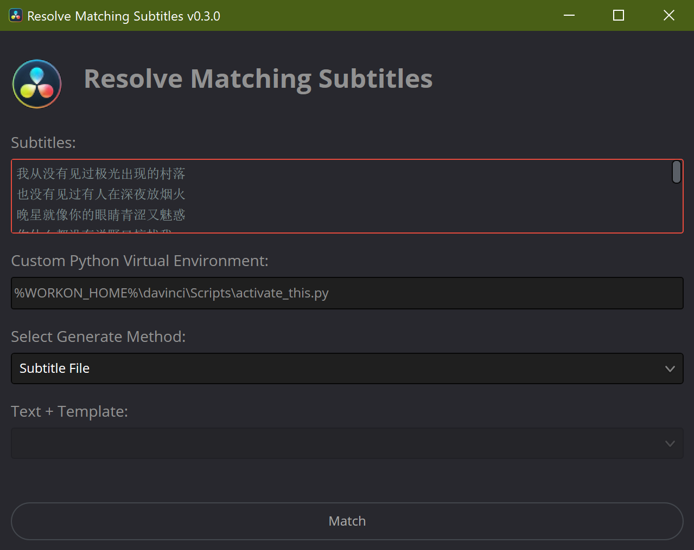

# Davinci Resolve Matching Subtitles



## Motivation

Davinci 18 可以识别字幕，尽管挺准确的，但是还是有错误的地方，如果已经有字幕文本了，那么希望直接使用已有字幕做打轴。目前 Davinci 18.6 还没有这个功能。

## 安装

1. 安装 Python >= 3.6
2. 安装 Python 包

```shell
pip install thefuzz
pip install srt
pip install pypinyin
```

或者创建 `davinci` 虚拟环境，再安装上面的包，可能更好一点。

3. 将 `Matching Subtitles.py` 拷贝到 `"%PROGRAMDATA%\Blackmagic Design\DaVinci Resolve\Fusion\Scripts\Utility"`
4. 默认该目录为 `C:\ProgramData\Blackmagic Design\DaVinci Resolve\Fusion\Scripts\Utility`

## 使用

相关视频：<https://www.bilibili.com/video/BV1ft421N7wu>

1. 首先使用 Davinci 创建字幕，最大长度 1
2. 然后 `Workspace` > `Script` > `Matching Subtitles`
3. 修改文本或将字幕输入到文本框中（**需要自己提前分行**）
4. 选择生成方式：
   1. 生成 srt 文件到媒体池
   2. 生成 Text + 视频轨道（需要选择一个 Text+ 作为模板）
5. 点击 Match
6. 对于不同的生成方式：
   1. 如果是字幕文件，项目资源中会创建一个匹配好的字幕，文件名为 `Subtitle` 文件，手动创建一个字幕轨，托入即可
   2. 生成 Text + 视频轨道，会自动创建一个对应的视频轨道

## 插件开发提示

和 Python 相关的插件 API 来自 [^auto_subs] 和 [^ui_api]，看起来像是 Davinci 换皮 QT，组件没有QT全面。具体内容可以参考项目目录下的 [Davinci_Script_References.txt](./Davinci_Script_References.txt) 和 [Davinci_UI_References.txt](./Davinci_UI_References.txt)。

## 更新日志

- 2024-09-07：v0.3.0 支持不同操作系统，提供修改 virtualenv 选项；
- 2024-05-27：v0.2.2 兼容 Davinci Resolve 19.0 BETA;
- 2024-05-26：v0.2.0 引入 fuzzy pinyin，使用拼音模糊匹配，提升匹配准确率；
- 2024-05-24：v0.0.1 创建项目，支持匹配基础字幕；

## References

[^auto_subs]: https://github.com/tmoroney/auto-subs
[^ui_api]: https://www.steakunderwater.com/wesuckless/viewtopic.php?t=1411&start=210
